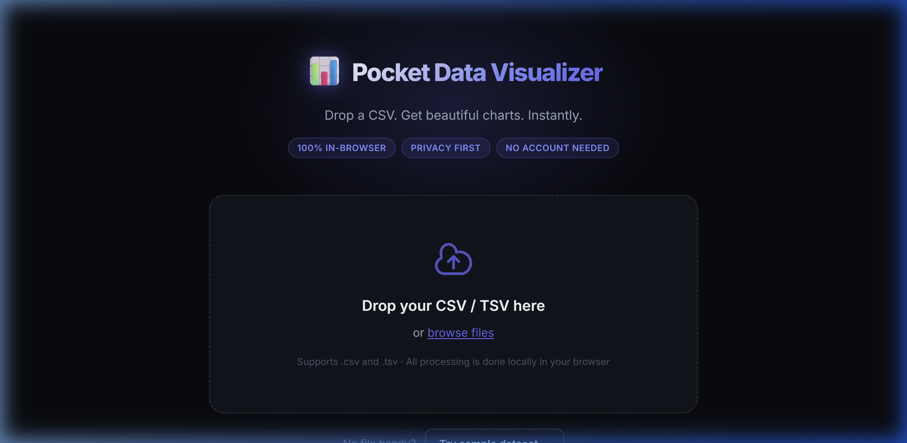
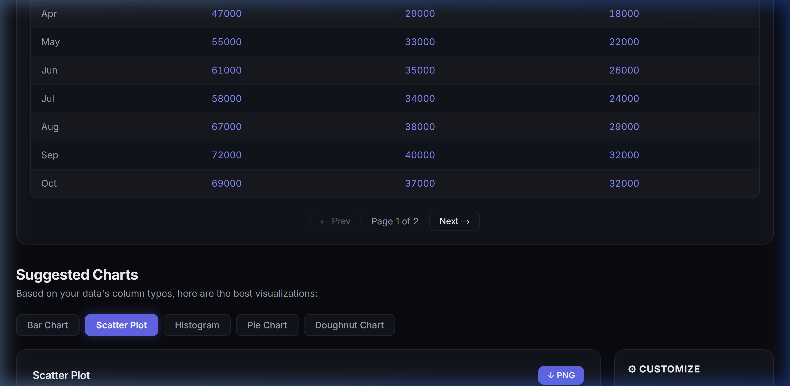

# 📊 Pocket Data Visualizer

> A lightweight, privacy-first web app that accepts CSV/TSV uploads, automatically infers column types, and suggests the best chart types with live interactive previews — all processed **locally in your browser**.

[](LICENSE)
[](CONTRIBUTING.md)
[](https://react.dev)
[](https://www.chartjs.org/)
[](https://vercel.com/new)

---

## 📋 Table of Contents

- [Live Demo](#-live-demo)
- [Features](#-features)
- [Screenshots](#-screenshots)
- [Tech Stack](#-tech-stack)
- [Getting Started](#-getting-started)
- [Project Structure](#-project-structure)
- [Sample Datasets](#-sample-datasets)
- [Contributing](#-contributing)
- [Roadmap](#️-roadmap)
- [Suggestions & Alternatives](#-suggestions--alternatives)
- [License](#-license)

---

## 🌐 Live Demo

> **[data-visualizer.vercel.app](https://data-visualizer.vercel.app)** ← Deploy your own fork with one click

[](https://vercel.com/new/clone?repository-url=https://github.com/VamsiKrishna/data-visualizer)

---

## ✨ Features

| Feature | Details |
|---------|---------|
| 📂 **Smart CSV/TSV Parser** | Auto-detects delimiter · Infers column types: `numeric`, `date`, `text`, `boolean` · Handles edge cases (BOM, quoted commas, empty cells) |
| 🧠 **Intelligent Chart Suggestions** | Ranks up to 5 chart types based on your data's shape · Explains why each chart fits |
| 📈 **Interactive Charts** | Bar · Line · Scatter · Pie · Doughnut · Histogram — all with hover tooltips |
| 🎨 **Live Customization** | Color picker + 8 presets · Edit axis labels · Toggle grid lines & legend · Switch axis columns |
| 📤 **Export** | Download charts as **PNG** · Export your (cleaned) data as **CSV** |
| 🔒 **100% Private** | No server, no login, no cookies — everything runs in your browser |
| ♿ **Accessible** | Full keyboard navigation · ARIA roles · Screen-reader-friendly |

---

## 📸 Screenshots

> *(Add screenshots to `docs/screenshots/` and uncomment below)*

<!--  -->
<!--  -->
<!--  -->

---

## 🛠 Tech Stack

| Layer | Technology |
|-------|-----------|
| UI Framework | [React 18](https://react.dev) (via [Vite](https://vitejs.dev)) |
| Charting | [Chart.js 4](https://www.chartjs.org) + [react-chartjs-2](https://react-chartjs-2.js.org) |
| CSV Parsing | [PapaParse](https://www.papaparse.com) |
| Language | JavaScript (ES2022) |
| Styling | Vanilla CSS (custom design system) |
| Fonts | [Inter](https://fonts.google.com/specimen/Inter) + [JetBrains Mono](https://fonts.google.com/specimen/JetBrains+Mono) |
| Linting | ESLint |
| CI/CD | GitHub Actions (planned) |

---

## 🚀 Getting Started

### Prerequisites

- [Node.js](https://nodejs.org) v18+ (LTS)
- npm v9+

### Installation

```bash
# 1. Clone the repository
git clone https://github.com/VamsiKrishna/data-visualizer.git
cd data-visualizer

# 2. Install dependencies
npm install

# 3. Start the dev server
npm run dev
```

Open **http://localhost:5173** in your browser.

### Build for Production

```bash
npm run build    # Output in /dist
npm run preview  # Preview the production build locally
```

### Deploy to Vercel

```bash
npm install -g vercel
vercel --prod
```

Or click the **Deploy on Vercel** button at the top of this README.

---

## 📁 Project Structure

```
data-visualizer/
├── public/
│   ├── favicon.svg
│   └── sample-datasets/          # Ready-to-use CSV files
│       ├── monthly-revenue.csv
│       ├── weather-2024.csv
│       ├── world-countries.csv
│       └── retail-sales.csv
├── src/
│   ├── components/
│   │   ├── FileUpload/            # Drag-and-drop upload zone
│   │   │   ├── FileUpload.jsx
│   │   │   └── FileUpload.css
│   │   ├── DataTable/             # Paginated data preview
│   │   │   ├── DataTable.jsx
│   │   │   └── DataTable.css
│   │   ├── ChartPanel/            # Chart renderer + export toolbar
│   │   │   ├── ChartPanel.jsx
│   │   │   └── ChartPanel.css
│   │   └── CustomizationPanel/    # Color, axis, and display controls
│   │       ├── CustomizationPanel.jsx
│   │       └── CustomizationPanel.css
│   ├── utils/
│   │   ├── csvParser.js           # PapaParse wrapper + type inference
│   │   ├── chartSuggest.js        # Chart recommendation algorithm
│   │   └── exportChart.js         # PNG/CSV download helpers
│   ├── App.jsx                    # Root component & state
│   ├── App.css                    # Layout styles
│   ├── index.css                  # Design system & global styles
│   └── main.jsx                   # React entry point
├── .github/
│   ├── ISSUE_TEMPLATE/            # Bug report & feature request templates
│   └── PULL_REQUEST_TEMPLATE.md
├── CONTRIBUTING.md
├── CODE_OF_CONDUCT.md
├── LICENSE
└── README.md
```

---

## 📂 Sample Datasets

Four ready-to-use CSV files are included in `public/sample-datasets/`:

| File | Rows | Best Charts |
|------|------|-------------|
| `monthly-revenue.csv` | 12 | Bar, Line |
| `weather-2024.csv` | 20 | Line, Scatter |
| `world-countries.csv` | 15 | Scatter, Bar |
| `retail-sales.csv` | 10 | Bar, Pie, Doughnut |

---

## 🤝 Contributing

Contributions are very welcome! Please read [CONTRIBUTING.md](CONTRIBUTING.md) first.

Quick steps:
1. Fork the repository
2. Create a feature branch: `git checkout -b feat/your-feature`
3. Make your changes and write tests if applicable
4. Open a Pull Request against `main`

See the [open issues](../../issues) for ideas on where to start.

---

## 🗺️ Roadmap

- [x] Vite + React project scaffold
- [x] CSV/TSV parser with column type inference
- [x] Intelligent chart suggestion algorithm (5 chart types)
- [x] Interactive charts: Bar, Line, Scatter, Pie, Doughnut, Histogram
- [x] Live chart customization panel
- [x] PNG + CSV export
- [x] Sample datasets
- [x] Full responsive layout
- [x] Accessibility (ARIA, keyboard nav)
- [ ] Unit tests (Vitest)
- [ ] PWA support (offline-capable)
- [ ] Dark / Light mode toggle
- [ ] Shareable chart URLs (encode data in URL hash)
- [ ] Drag-to-reorder columns
- [ ] Multi-series charts (plot multiple Y columns)

---

## 💬 Suggestions & Alternatives

### Better libraries to consider for future growth

| Library | Why |
|---------|-----|
| [Observable Plot](https://observablehq.com/plot/) | Concise grammar-of-graphics API built on D3 — less boilerplate than raw Chart.js |
| [Apache ECharts](https://echarts.apache.org/) | 20+ chart types, GPU-accelerated, massive datasets |
| [Vega-Lite](https://vega.github.io/vega-lite/) | Declarative JSON specs, automatic chart recommendations built-in |

### Architectural ideas

1. **URL-hash data mode** — encode small datasets in the URL so charts become shareable with no backend
2. **Multi-series support** — let users pick multiple Y-columns plotted on the same chart
3. **Local heuristic insights** — print a one-line observation ("Sales peak in Q4 every year") using simple trend detection, no AI API needed
4. **PWA / offline mode** — cache assets with a service worker so the app works without internet

---

## 📄 License

This project is licensed under the **MIT License** — see [LICENSE](LICENSE) for details.

---

<div align="center">
  Made with ❤️ by <a href="https://github.com/VamsiKrishna"><strong>VamsiKrishna</strong></a><br/>
  If this project helped you, please ⭐ star the repo!
</div>
